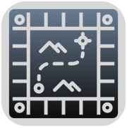

<!-- TOP LINK -->

<!-- Parameters:
*** `XBlayz`, `Snakes_n_Ladders_sim`,
*** `S. Scarcelli`, `protonmail.com`, `xblayz.github`,
*** `Snakes & Ladders - Simulator`, `A program for simulate Snakes & Ladders matches`
*** `A program for simulate **Snakes & Ladders** matches with different _layer of customization_ like custom **board**, different **rules** and _many more_.`
*** `MIT License`
-->

<!-- PROJECT SHIELDS -->
[![Contributors][contributors-shield]][contributors-url]
[![Discussions][discussions-shield]][discussions-url]
[![Forks][forks-shield]][forks-url]
[![Stargazers][stars-shield]][stars-url]
[![Issues][issues-shield]][issues-url]
[![License][license-shield]][license-url]

<!-- PROJECT LOGO -->
 

  

<h3 align="center">Snakes & Ladders - Simulator</h3>

  

    A program for simulate Snakes & Ladders matches
     
    <a href="https://github.com/XBlayz/Snakes_n_Ladders_sim"><strong>Explore the docs »</strong></a>
     
     
    <a href="https://github.com/XBlayz/Snakes_n_Ladders_sim">View Demo</a>
    ·
    <a href="https://github.com/XBlayz/Snakes_n_Ladders_sim/issues">Report Bug</a>
    ·
    <a href="https://github.com/XBlayz/Snakes_n_Ladders_sim/issues">Request Feature</a>
    .
    <a href="https://github.com/XBlayz/Snakes_n_Ladders_sim/discussions">Discussions</a>
  

<!-- TABLE OF CONTENTS -->

  
Table of Contents

  <ol>
    <li>
      <a href="#about-the-project">About The Project</a>
      <ul>
        <li><a href="#built-with">Built With</a></li>
      </ul>
    </li>
    <li>
      <a href="#getting-started">Getting Started</a>
      <ul>
        <li><a href="#prerequisites">Prerequisites</a></li>
        <li><a href="#installation">Installation</a></li>
      </ul>
    </li>
    <li><a href="#usage">Usage</a></li>
    <li><a href="#roadmap">Roadmap</a></li>
    <li><a href="#contributing">Contributing</a></li>
    <li><a href="#license">License</a></li>
    <li><a href="#contact">Contact</a></li>
    <li><a href="#acknowledgments">Acknowledgments</a></li>
  </ol>

<!-- ABOUT THE PROJECT -->
## About The Project

[![Product Name Screen Shot][product-screenshot]]

A program for simulate **Snakes & Ladders** matches with different _layer of customization_ like custom **board**, different **rules** and _many more_.

(<a href="#readme-top">back to top</a>)

### Built With
<!-- https://shields.io/ -->
<!-- https://github.com/Ileriayo/markdown-badges -->

(<a href="#readme-top">back to top</a>)

<!-- GETTING STARTED -->
## Getting Started
For compiling the project you just need to run the **Gradle** _task_: `build` and than extract the file form the `app.zip` file in the folder `app/build/distributions`, or just run the **Gradle** _task_: `run` for executing the application directly.

### Prerequisites
* **Java** `17+` (Developed in **Java** `21`)
* **JavaFX** `21` (_Gradle_ dependency)
* **Jackson** `2.17.2` (_Gradle_ dependency)
* **Logback** `1.5.6` (_Gradle_ dependency)
* **Lombok** `1.18.34` (_Gradle_ dependency)

### Installation
1. Use the `.jar` file from the build

(<a href="#readme-top">back to top</a>)

<!-- USAGE EXAMPLES -->
## Usage
For running the program run the following command in the repository folder:
- Powershell: `.\gradlew run`
- Linux: `gradlew run`

(<a href="#readme-top">back to top</a>)

<!-- ROADMAP -->
## Roadmap
- [X] Main menu _(NFR)_
- [X] **New simulation menu**
  - [X] Save settings _(FR)_
  - [X] Load settings _(FR)_
    - [X] Multithread _(NFR)_
- [X] **Simulation**
  - [X] Main simulation windows _(FR)_
  - [X] Manual advancement _(FR)_
  - [X] Automatic advancement _(FR)_
    - [X] Simulation speed _(NFR)_
  - [X] Game board _(FR)_
    - [X] Custom board dimensions _(FR)_
    - [X] Board cell settings _(FR)_
    - [X] Snakes & Ladders cell _(FR)_
    - [X] Special cell type _(FR)_
      - [X] "Parking" cell (Bench or Inn) _(FR)_
      - [X] "Price" cell (Dice or Spring) _(FR)_
      - [X] "Draw a Card" cell _(FR)_
  - [X] Players _(FR)_
  - [X] Dice _(FR)_
    - [X] Dice number _(NFR)_
    - [X] Dice type _(NFR)_
    - [X] Sigle dice rule _(FR)_
    - [X] Doble six rule _(FR)_
  - [X] Deck of cards _(FR)_
    - [X] Standard cards (Bench, Inn, Dice and Spring) _(FR)_
    - [X] Extra cards (Do Not Stop) _(FR)_
  - [X] End of simulation results _(FR)_
    - [X] Report log _(NFR)_
- [X] _DEBUG_
  - [X] Logger
    - [X] Setup logger settings
  - [X] Test

See the [open issues](https://github.com/XBlayz/Snakes_n_Ladders_sim/issues) for a full list of proposed features (and known issues).

(<a href="#readme-top">back to top</a>)

<!-- CONTRIBUTING -->
## Contributing
Contributions are what make the open source community such an amazing place to learn, inspire, and create. Any contributions you make are **greatly appreciated**.

If you have a suggestion that would make this project better, please fork the repo and create a pull request. You can also simply open an issue with the tag "enhancement".
Don't forget to give the project a star! Thanks again!

1. Fork the Project
2. Create your Feature Branch (`git checkout -b feature/AmazingFeature`)
3. Commit your Changes (`git commit -m 'Add some AmazingFeature'`)
4. Push to the Branch (`git push origin feature/AmazingFeature`)
5. Open a Pull Request

(<a href="#readme-top">back to top</a>)

<!-- LICENSE -->
## License
Distributed under the MIT License License. See `LICENSE` for more information.

(<a href="#readme-top">back to top</a>)

<!-- CONTACT -->
## Contact
S. Scarcelli - xblayz.github@protonmail.com.com

Project Link: [https://github.com/XBlayz/Snakes_n_Ladders_sim](https://github.com/XBlayz/Snakes_n_Ladders_sim)

(<a href="#readme-top">back to top</a>)

<!-- ACKNOWLEDGMENTS -->
## Acknowledgments
* _Prof._ **A.** **Furfaro** - _(UNICAL, Professore corso **Ing. del Software**)_
* _Prof._ **F.** **Blefari** - _(UNICAL, Esercitatore corso **Ing. del Software**)_
* [Bro Code](https://youtu.be/9XJicRt_FaI?si=DG6TItrVz8V4ODj-) - _(JavaFX tutorial)_
* [Tom Gregory Tech](https://youtu.be/-dtcEMLNmn0?si=TSBWCfkbVy5r3RkX) - _(Gradle tutorial)_
* Icons made by <a href="https://www.flaticon.com/authors/reion" title="Reion"> Reion</a> from <a href="https://www.flaticon.com/" title="Flaticon">Flaticon.com</a>

(<a href="#readme-top">back to top</a>)

<!-- MARKDOWN LINKS & images -->
<!-- https://www.markdownguide.org/basic-syntax/#reference-style-links -->
[contributors-shield]: https://img.shields.io/github/contributors/XBlayz/Snakes_n_Ladders_sim.svg?style=for-the-badge
[contributors-url]: https://github.com/XBlayz/Snakes_n_Ladders_sim/graphs/contributors
[forks-shield]: https://img.shields.io/github/forks/XBlayz/Snakes_n_Ladders_sim.svg?style=for-the-badge
[forks-url]: https://github.com/XBlayz/Snakes_n_Ladders_sim/network/members
[discussions-shield]: https://img.shields.io/github/discussions/XBlayz/Snakes_n_Ladders_sim.svg?style=for-the-badge
[discussions-url]: https://github.com/XBlayz/Snakes_n_Ladders_sim/discussions
[stars-shield]: https://img.shields.io/github/stars/XBlayz/Snakes_n_Ladders_sim.svg?style=for-the-badge
[stars-url]: https://github.com/XBlayz/Snakes_n_Ladders_sim/stargazers
[issues-shield]: https://img.shields.io/github/issues/XBlayz/Snakes_n_Ladders_sim.svg?style=for-the-badge
[issues-url]: https://github.com/XBlayz/Snakes_n_Ladders_sim/issues
[license-shield]: https://img.shields.io/github/license/XBlayz/Snakes_n_Ladders_sim.svg?style=for-the-badge
[license-url]: https://github.com/XBlayz/Snakes_n_Ladders_sim/blob/master/LICENSE.txt
[product-screenshot]: .img/screenshot.png
