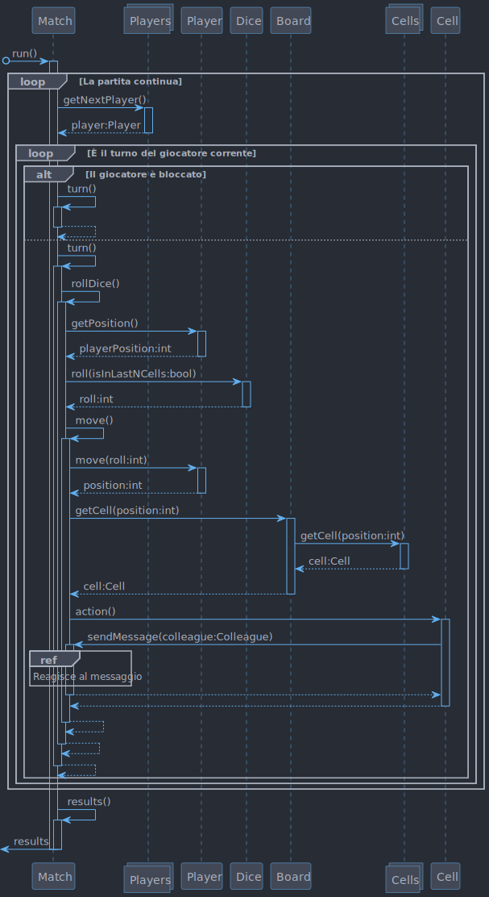

= “Ingegneria del Software” | 2023-2024
Docente: Prof. Angelo Furfaro; Studente: Stefano Scarcelli - 230668 <scrsfn02t15d086u@studenti.unical.it>
Documento Finale (D3) | {docdate}
:doctype: article
:title-separator: |
:toc:

.*List of Challenging/Risky Requirements or Tasks*
|===
^.^|Challenging Task ^.^|Date the task is identified ^.^|Date the challenge is resolved ^.^|Explanation on how the challenge has been managed

.^|Impostazione del _progetto_ con sistema di automazione di *build*, *test* e gestore delle *dipendenze*
^.^|17/06/2024
^.^|18/06/2024
|Tentativo di uso di *Maven*, poi scartato per via di errori nella gestione della dependency di _JavaFX_, e scelta della soluzione tramite *Gradle*

.^|Esecuzione delle _azioni_ delle varie celle sui *giocatori* permettendo _catene di eventi_
^.^|04/07/2024
^.^|06/07/2024
|Spezzettamento della logica dei turni in funzioni _richiamate a catena_ e uso del pattern *Mediator* per determinare il tipo di _azione_ da eseguire tramite gli oggetti `Cell` mantenendo la responsabilità dell'esecuzione all'oggetto `Match`

.^|Gestione evento di _scarto di una carta_ da parte del *giocatore* nel *mazzo*
^.^|06/07/2024
^.^|06/07/2024
|Uso del pattern *Mediator* precedentemente implementato per gestire la _notifica_ da parte di un *giocatore* dell'_inserimento nel fondo del mazzo_ di una *carta*

.^|Gestione costruzione del *tabellone* in più modi _differenti_
^.^|09/07/2024
^.^|##/07/2024
|Uso del pattern *Strategy* con la definizione di diversi _oggetti_ (_strategie_) per la costruzione del *tabellone*

|===

== A. Stato dell’Arte
_Analizzate sistemi esistenti, prendete spunto da cio’ che esiste._

=== A.1 Web application:
* *Snakes and Ladders* (https://www.crazygames.com/game/snakes-and-ladders[Play on CrazyGames])
** Presenza di due modalità con rappresentazione grafica differente;
** Possibilità di giocare *Player VS Player* (tutti contro tutti) o *Player VS Computer* (1 VS Computer);
** Possibilità di giocare da *2* a *6* _giocatori_;
** Animazione lancio di dadi (pre renderizzata, non in real time);
** Indicatore di _turno_;
** Piccola schermata di spiegazione delle *regole di gioco*;
* *Play Snakes and Ladders* (https://www.calculators.org/games/snakes-and-ladders/[Calculators.org])
** Grafica stilizzata;
** Modalità *Single Player* e *Multi Player*;
** Possibilità di giocare da *2* a *4* _giocatori_;
** Effetti sonori;
** *Leader board*;
** Indicatore di _turno_;
* *Snakes And Ladders* (https://www.playonlinedicegames.com/snakesandladders[Playonlinedicegames.com])
** Possibilità di giocare *Player VS Player* (1 VS 1) o *Player VS Computer* (1 VS Computer);
** Interfaccia semplice;
** Animazioni di turno rapide;
* *Snakes And Ladders* (https://www.alc.ca/content/alc/en/play-online/instant-win-games/snakes-ladders.html[Atlantic Lottery])
** Gioco d'azzardo;

=== A.2 PC & Game console:
* *Snakes & Ladders+ : Board Game* (https://www.xbox.com/it-IT/games/store/snakes-ladders-board-game-pc-xbox/9P1K912MHQKB[Link])
** Tema marino;
** Possibilità di giocare *Player VS Player* (1 VS 1) o *Player VS Computer* (1 VS Computer);
** Diversi _tabelloni_;
** Spiegazione esaustiva delle *regole di gioco*;
* *Snake and Ladder Game for Windows 10* (https://download.cnet.com/snake-and-ladder-game-for-windows-10/3000-2111_4-77568851.html[Link])
** Giocabile da *2* a _più giocatori_ (non specificato nella descrizione);
** Tabellone da *100* _caselle_;
** Possibilità di scegliere il *colore* del _tabellone_ tra vari preset;

=== A.3 Mobile game:
* *Snakes and Ladders* (https://play.google.com/store/apps/details?id=ir.Hadiware.Snake_Ladder&hl=en_US[Link])
** Vari *temi* e *tipologie* di _tabelloni_;
** Possibilità di giocare da *2* a *4* _giocatori_;
** Possibilità di selezionare _individualmente_ per pedina se _escluderla_, inserirla come *giocatore* o inserirla come *computer*;
* *Snakes and Ladders Board Games* (https://play.google.com/store/apps/details?id=com.idz.snakes.and.ladders.dice.board.games&hl=en_US[Link])
** Grafica 3D;
** Gioco a *livelli*;
** Il _tabellone_ è sostituito con un *percorso* di una _mappa a tema_;

== B. Raffinamento dei Requisiti
_A partire dai servizi minimali richiesti, raffinate la descrizione dei servizi offerti dal vostro applicativo. Descrivete anche I requisiti non funzionali._

=== B.1 Servizi (con prioritizzazione)
_Descrivete in *dettaglio* i servizi offerti dal vostro Sistema, insieme a quelli che ritenete siano le soluzioni concettuali necessarie. In questa fase, non fate riferimento ad alcuna tecnologia specifica. Se volete, intervistate stakeholder e collezionate dati dal web o da altre sorgenti. Dovete acquisire una conoscenza avanzata dei problemi associate ai vostri servizi. Assegnate un ID a ciascun servizio. Prioritizzate inoltre i servizi in base a due scale: Importanza alta, media, bassa. Complessità alta, media, bassa._

. _Impostazione della partita da simulare:_
.. Interfaccia di setup (*Importanza* _media_, *Complessità* _bassa_)
... Impostazione dimensione tabellone
... Impostazione posizione delle caselle
.. Salvare/caricare setup (*Importanza* _bassa_, *Complessità* _media_)
. _Simulazione della partita:_
.. Avanzamento automatico e manuale dei turni (*Importanza* _alta_, *Complessità* _bassa_)
.. Lancio dei dai (*Importanza* _alta_, *Complessità* _media_)
... Dadi doppi o singoli
... Regola del dado singolo
... Regola del doppio sei
.. Regole di movimento delle pedine (*Importanza* _alta_, *Complessità* _alta_)
... Caselle "Scale & Serpenti"
... Caselle "Sosta"
... Caselle "Premio"
... Caselle "Pesca una Carta"
.. Mazzo di carte (*Importanza* _media_, *Complessità* _alta_)
... Carte standard
... Carte extra
. _Visualizzazione dei turni simulati:_
.. Rappresentazione del tabellone (*Importanza* _media_, *Complessità* _alta_)
.. Rappresentazione delle pedine sul tabellone (*Importanza* _media_, *Complessità* _bassa_)
. _Visualizzazione dei risultati della partita:_
.. Vincitore della partita (*Importanza* _alta_, *Complessità* _bassa_)
.. Classifica finale (*Importanza* _bassa_, *Complessità* _bassa_)

.Importanza/Complessità dei servizi
[cols="1,5a"]
|===
| ^.^|Complessità

^.^|*Importanza*
|

!===
! ^.^!Bassa ^.^!Media ^.^!Alta

^.^!*Bassa*
!4.b
!1.b
!

^.^!*Media*
!1.a, 3.b
!
!2.d, 3.a

^.^!*Alta*
!2.a, 4.a
!2.b
!2.c

!===

|===

=== B.2 Requisiti non Funzionali
_Elencare i requisiti non funzionali più’ importanti per il vostro Sistema._

. _Interfaccia grafica_ (*GUI*):
.. Menu principale
.. Interfaccia di simulazione
. _Regole:_
.. Numero di dadi
.. Tipologia dei dadi (numero di facce)
. _Simulazione della partita:_
.. Simulazione partite su thread separato
. _Termine simulazione:_
.. Salvare log della simulazione

=== B.3 Scenari d’uso dettagliati
_Descrivere gli scenari più comuni, più interessanti, o più complicati d’uso dei vostri servizi._

* *Analisi di dati in vari scenari*:
** Analizzare quanto il _valore dei dadi_ di un giocatore contribuisce sul suo _tasso di vincita_
** Analizzare come cambiano la _durata di ogni partita_ al _variare delle regole_
** Analizzare quali sono le _caselle più visitate_ dai vari giocatori
* *Gioco*:
** Eseguire _partite con un gruppo di giocatori_
** Giocare a _prevedere quale pedina vincerà_ la partita

=== B.4 Requisiti esclusi
_Descrivere i servizi eventualmente i esclusi, e spiegare il perché_

. _Animazioni 3D:_
.. *Animazioni lancio dadi in 3D* (_Richiede l'uso di un engine 3D portando solo un miglioramento visivo, fuori dallo scopo del software_)
.. *Animazioni mazzo di carte in 3D* (_Richiede l'uso di un engine 3D portando solo un miglioramento visivo, fuori dallo scopo del software_)
. _Audio_
.. *Effetti sonori* (_Richiedono la creazione o licenza di effetti sonori portando solo un miglioramento visivo, fuori dallo scopo del software_)
. _Simulazione:_
.. *Simulazione singola partita in multithread* (_Non è richiesto eseguire simulazioni a velocità elevate per una singola partita, in più aumenta esponenzialmente la complessità del software potenzialmente senza alcun beneficio tangibile_)
.. *Simulazione di più partite rapide con diverse impostazioni con gestione in coda* (_Scenario estremo non di uso comune che può essere facilmente bypassato aspettando il termine delle varie simulazioni_)
. _Piattaforme di distribuzione:_
.. *Piattaforme mobile* (_Software principalmente simulatilo, uso in mobilità poco utile_)
.. *Piattaforme web* (_Implementazione web app fuori dagli scopi del progetto_)
. _Interazioni & Integrazioni:_
.. *API* (_Potenzialmente utile per automatization di task e integrazione in altri software ma fuori dallo scopo del progetto_)
.. *Supporto a mod o plugin* (_Potenzialmente utile per aggiungere funzionalità extra in modo rapido da parte dell'utente ma aumento della complessità e del rischio di introduzione di bug o vulnerabilità, con conseguente aumento della complessita per il supporto post rilascio_)

=== B.5 Assunzioni
_Documenta brevemente, in questa sezione, le ipotesi/decisioni sui requisiti più rilevanti che hai dovuto prendere durante il tuo progetto_

* Il _software_ è pensato come uno *strumento di simulazione* per tanto _l'interazione dell'utente_ durate una partita è ridotto al minimo;
* Il _software_ ha come obbiettivo solo quello di *ricavare i dati* dalle simulazione, non quello di aiutare l'utente ad _interpretarli_, per tanto la visualizzazione di essi potrebbe risultare parziale e non esaustiva. Per questo motivo *l'esportazione dei dati* risulta essere una funzionalità _relativamente importante_ per l'obbiettivo richiesto;
* Il _software_ è pensato per essere eseguito su *piattaforma PC* con _hardware relativamente moderno_ senza ottimizzazioni estensive sia dal punto di vista della _simulazione_ che della _GUI_;
* Si riserva che qualsiasi dei <<B.4 Requisiti esclusi,Requisiti esclusi>> possano essere aggiunti in *versioni future* del _software_;

=== B.6 Use Case Diagrams

== C. Architettura Software
_SE PERTINENTE, riporta qui sia la vista statica che dinamica della progettazione del tuo sistema, in termini di diagramma dei componenti e i relativi diagrammi di sequenza._

=== C.1 La visione statica del sistema: Diagramma dei Componenti

=== C.2 La visione dinamica dell'architettura software: Sequence Diagram

==== Sequence Diagram (GUI)

==== Sequence Diagram (Simulazione)

== D. Dati e loro modellazione  (se il sistema si interfaccia con un DBMS)
_Definite le sorgenti di dati a voi necessarie per realizzare I servizi di cui sopra. Modellate tali dati tramite un ER o similari. Specificate se e quali di tali dati sono gia’ forniti da applicativi esistenti._

*Il sistema non fa uso di DBMS.*

== E. Scelte Progettuali (Design Decisions)
_Documenta qui le 5 decisioni progettuali più importanti che hai dovuto prendere. È possibile utilizzare sia una specifica testuale che schematica._

=== E.1 Definizione delle entità della simulazione
Come prima cosa ho deciso di partire dalla definizione delle _entità_ che rappresenteranno la *partita*, sia dal punto di vista delle _responsabilità_ che da quello della distribuzione delle varie _proprietà_ (impostazioni) della *partita*.

Ho optato per una struttura _simil-albero_, con un entità principale (*Match*) che racchiude tutte le altre principali (con anche esse che a loro volta possono essere composte da altre entità). In essa sarà presenta la logica principale della *simulazione* (main loop) con le proprietà che definiscono lo stato attuale della *simulazione* e che gestiscono il flusso di essa.

Successivamente ho suddiviso la *partita* nelle varie _sotto entità_ principali:

* *Giocatore* (_Player_)
** Contiene tutte le informazioni relative ad un singolo giocatore tra cui: *Posizione sul tabellone*, *Numero di turni per cui è bloccato*, *Carte in possesso*
** In più è responsabile per il suo *spostamento*, gestione dello *stato di blocco* e uso delle *carte in possesso*
* *Tabellone* (_Board_)
** Contiene la collezione delle *Celle*, altra entità che definisce le _azioni_ che un *giocatore* deve eseguire quando vi si trova sopra
** Ho deciso di implementarla come _classe assestante_, invece che semplice _collezione_, per permettere la definizione di funzioni specifiche aggiuntive in futuro
* *Dadi* (_Dice_)
** Contiene tutte le informazioni relative al *lancio dei dadi* tra cui, oltre alla definizione dei dadi stessi (estremamente flessibile sia sul _numero di facce_ che _numero di dadi_), anche le informazioni relative alle regole che *influenzano il lancio dei dadi*
* *Mazzo di carte* (_Deck_)
** Anche essa definisce una collezione di *Carte*, oggetti definiti tramite il pattern *_SINGLETON_ *(implementati tramite _enumerator_) che rappresentano il tipo della carta
** Anche essa come il *Tabellone* è come _classe assestante_, invece che semplice _collezione_, per poter implementare la gestione diretta delle carte come: *mescolamento delle carte alla creazione* e *pesca con scarto automatico* delle carte così dette _istantanee_
** Le *Carte* in se non forniscono alcuna direttiva relativa alla'azione da eseguire, è la *Partita* a gestire le azioni che le carte definiscono

=== E.2 Gestione delle relazioni tra entità della simulazione (Mediator)
Per la gestione delle *interazioni* tra le entità di _pari livello_ (cioè le _entità_ che hanno lo stesso _padre_), per limitare al minimo le dipendenze, ho optato per l'uso del design pattern *_MEDIATOR_*.

image::../out/doc/UML diagrams/Mediator Diagram/Mediator Diagram.svg[]

=== E.3 Costruzione del tabellone (Strategy)
Per la costruzione del *tabellone* ho scelto di usare il patter *_STRATEGY_*, definendo un oggetto per la costruzione costruzione delle varie *celle* nelle varie posizioni (_matrice_ di *celle*).

Il motivo di questa scelta è legata alla possibilità di poter definire, in maniera indipendente dal *tabellone*, vari modi di costruirlo (ad esempio, random, manuale o anche un misto di varie strategie) permettendo di modificare le due funzionalità in maniera indipendente.

=== E.4 Gestione del main loop della simulazione
Per quanto riguarda il *main loop* implementato nel metodo _run()_ di *Match*, una soluzione potrebbe essere quella di usare il pattern *_STATE_*, ma ho optato per un'implementazione classica (usando metodi richiamati a cascata) in quanto la logica generale _non dovrebbe cambiare in modo prevalente_ in futuro e soprattutto l'implementazione richiederebbe molto _tempo_ e _spezzetterebbe_ il codice in maniera eccessiva.

=== E.5 Comunicazione GUI-Simulazione
Con l'implementazione della *GUI* e della *Simulazione* tramite thead indipendente, ho dovuto determinare un modo per far comunicare i due _componenti_ e ho così individuato 3 principali strategie:

* Uso di *monitor* e passaggio di dati tramite _metodi_ e _variabili_
** Implementare dei metodi da usare per far comunicare il thread della *GUI* con quello della *Simulazione* sincronizzandoli appropriatamente
** + Efficiente
** - Implementazione complessa
** - Rischio di introdurre bug
** - Introduzione di dipendenze
* Uso di *task*
** Particolari oggetti forniti dal framework *JavaFX* che permettono di eseguire operazioni in _background_ per interagire con la *GUI*
** + Strumento molto flessibile
** + Sicuro ed efficiente
** - Richiede una re-implementazione del main loop
* Uso di *Platform.runLater(...)*
** Particolare classe fornita dal framework *JavaFX* che permette il passaggio di un _Runnable_ di eseguire operazioni sulla *GUI* in maniera automatica
** + Semplice e veloce da implementare
** + Sicuro e rapido nell'esecuzione
** - Non ottimale per operazioni lunghe e complesse

Per la gestione degli _eventi_ legati alla *simulazione*, la mia scelta è ricaduta sull'ultima opzione, per via della _semplicità_ d'uso e la possibilità di definire *singole funzioni* che eseguono _semplici operazioni_ (simile a dei messaggi) in maniera disconnessa dal *main loop thread*, che può operare in modo indipendente (la classe *Platform* implementa un lista di richieste permettendo l'accumulo e lo smaltimento di esse in maniera automatica da parte della *GUI*).

Per la gestione dell'avanzamento _manuale_ o _automatico_ della *simulazione* ho invece optato per la prima opzione, in quanto l'uso di *Platform.runLater(...)* non garantisce l'istantaneità dell'esecuzione dell'azione, fondamentale per una ottima responsività della *GUI*.

== F. Progettazione di Basso Livello

=== F.1 Simulazione
L'implementazione della simulazione si basa sull'esecuzione del thread *Match* che implementa nel metodo `run()` il _main loop_ della partita. In questa classe sono definite tutte le condizioni e le operazioni da eseguire per permettere alla simulazione di procedere. Le operazioni sono gestite dalla classe *Matach* che interagisce con tutte le altre entità che la compongono e si pone da intermediario (*_MEDIATOR_*) tra di esse.

Ogni operazione è racchiusa in un metodo separato che, a cascata, chiama i metodi successivi per procedere con la simulazione.

Il _main loop_ si compone da 3 fasi principali:

. Individuazione del giocatore che deve prendere turno
.. Questa fase è semplicemente gestita da un indice che viene incrementato ogni volta che un giocatore termina il proprio turno e quando anche l'ultimo giocatore ha terminato il turno questo viene riportato a 0, ripetendo le turnazioni
. Esecuzione del turno
.. Il turno è composto a sua volta da 4 fasi:
... Verifica se il giocatore è bloccato (è l'entità *Player* a tenere traccia di ciò)
... Lanciare i dadi (eseguendo il metodo `roll(boolean isBoardLastNCells)` e passando come parametro la se è verificata la condizione della regola *_Dado Singolo_*)
... Movimento del giocatore (muovendo il *Player* e verificando che il giocatore non abbia vinto o sia uscito fuori dal tabellone, nel primo caso si ritorna terminando la partita, mentre nel secondo caso sposta il giocatore all'inizio del tabellone del movimento residuo)
... Esecuzione dell'azione della cella (che tramite il patter *_MEDIATOR_* segnala all'oggetto *Match* di eseguire l'operazione richiesta sul giocatore corrente)
. Terminazione del turno
.. Si verificano le condizioni se il turno del giocatore è finito e deve eseguire un'altro turno
.. E si verificano le condizioni se la partita è terminata con un vincitore

Nel _main loop_ sono in più presenti diversi _interrupt check_ in modo da terminare il loop non appena esso viene interrotto (per esempio dalla chiusura della *GUI*).

=== F.2 GUI
Le varie schermate della *GUI* sono state implementate tramite l'uso del software *Scene Builder* e per ognuna di esse è stato definito un `Controller`, una classe speciale che inizializza i vari componenti della scena e ne gestisce le interazioni tramite degli `EventListener`.

In più è il controller della schermata di setup a costruire ed avviare direttamente l'oggetto *Match* relativo alla partita da simulare. In questo modo esso ne possiede un riferimento che può passare al controller relativo alla schermata di simulazione che può usare per comunicare con esso.

L'implementazione dei controller segue le linee guida descritte nella documentazione del framework.

== G. Spiegare come il progetto soddisfa i requisiti funzionali (RF) e quelli non funzionali (RNF)
_Riporta in questa sezione in che modo la progettazione architettonica e di basso livello prodotta soddisfa gli RF e gli RNF._

=== G.1 RF
. _Impostazione della partita da simulare:_
.. Interfaccia di setup
... Impostazione dimensione tabellone (Da un minimo di 3 ad un massimo di 15 per dimensione)
... Impostazione posizione delle caselle (Possibilità di scegliere il *BoardStrategyBuilder*)
.. Salvare/caricare setup (Salvataggio e caricamento dei setup tramite file _YAML_)
. _Simulazione della partita:_
.. Avanzamento automatico e manuale dei turni (Checkbox che permette di scegliere se abilitare l'avanzamento automatico, o se usare il tasto di avanzamento manuale che si disabilita in avanzamento automatico)
.. Lancio dei dai
... Dadi doppi o singoli (Possibilità di scegliere tra 1 o 2 dadi)
... Regola del dado singolo (Checkbox che si disabilita se è stato scelto 1 dado solo)
... Regola del doppio sei (Checkbox che si disabilita se è stato scelto 1 dado solo)
.. Regole di movimento delle pedine
... Caselle "Scale & Serpenti" (Checkbox)
... Caselle "Sosta" (Checkbox)
... Caselle "Premio" (Checkbox)
... Caselle "Pesca una Carta" (Checkbox)
.. Mazzo di carte
... Carte standard (Abilitata automaticamente se la Checkbox "Pesca una Carta" è attiva)
... Carte extra (Checkbox che si disabilita se le carte sono disabilitate)
. _Visualizzazione dei turni simulati:_
.. Rappresentazione del tabellone (Tabellone rappresentato tramite griglia con numero cella e tipologia)
.. Rappresentazione delle pedine sul tabellone (All'interno della cella tramite un numero colorato)
. _Visualizzazione dei risultati della partita:_
.. Vincitore della partita (Popup a termine della simulazione)
.. Classifica finale (Possibilità di consulate il tabellone al temine della partita o tramite log)

=== G.2 RNF
. _Interfaccia grafica_ (*GUI*):
.. Menu principale (Menu principale semplice per presentare il software)
.. Interfaccia di simulazione (Schermata di simulazione interattiva)
. _Regole:_
.. Numero di dadi (Predisposizione per scelta di dadi superiore a 2)
.. Tipologia dei dadi (Predisposizione per scelta di dadi con facce superiore a 2)
. _Simulazione della partita:_
.. Simulazione partite su thread separato (Implementazione della classe *Match* su thread)
. _Termine simulazione:_
.. Salvare log della simulazione (Uso del logger *_Logback_*)

== Appendice. Prototipo
_Fornisci un breve rapporto sul tuo prototipo e in particolare: informazioni su ciò che hai implementato, come l'implementazione copre RF e RNF, come i prototipi dimostrano la correttezza del tuo progetto rispetto a RF e RNF. Puoi aggiungere alcuni screenshot per descrivere quanto richiesto sopra. Preparati a mostrare il tuo prototipo durante l'esame orale._

Il prototipo implementa quasi tutti i requisiti richiesti, la possibilità di impostare una partita con i vari parametri modificabili per abilitare o disabilitare le varie regole, assicurando la compatibilità di esse. Permette il salvataggio e caricamento su file delle impostazioni di una parita in formato YAML.

.Menu di impostazioni della simulazione

.Schermata di visualizzazione della partita avviata

La simulazione viene eseguita in completa autonomia, con la sola interazione richiesta dall'utente per la gestione dell'avanzamento dei turni che può essere automatico o manuale. Le varie e entità che compongono la simulazione sono testate tramite l'uso di test unitari con l'ausilio della libreria *JUnit*. I test pur non essendo esaustivi (troppo complesso e superfluo) dimostrano la correttezza delle varie operazioni di cui ogni oggetto e responsabile, verificando tutti i componenti più critici del software. Fa eccezione il testing del _main loop_ che essendo molto complesso (e principalmente basato su eventi casuali) richiederebbe un testing estremamente estensivo e complesso. La valutazione della suo correttezza e stata verificata manualmente esaminando i log, verificando che le varie operazioni vengono eseguite correttamente (stato coerente dei dati) e nell'ordine prestabilito.

La rappresentazione della simulazione sulla GUI può risultare grezza e poco rifinita ma svolge correttamente la sua funzione di visualizzazione dello stato attuale della partita, mentre i log generati durante la simulazione risultano più esaustivi mostrando lo storico completo delle operazioni eseguite e permettendo un'analisi più approfondita della simulazione stessa.

[source,log]
----
include::.file/logFile_INFO.log[lines=1..16]
...
include::.file/logFile_INFO.log[lines=142..145]
----